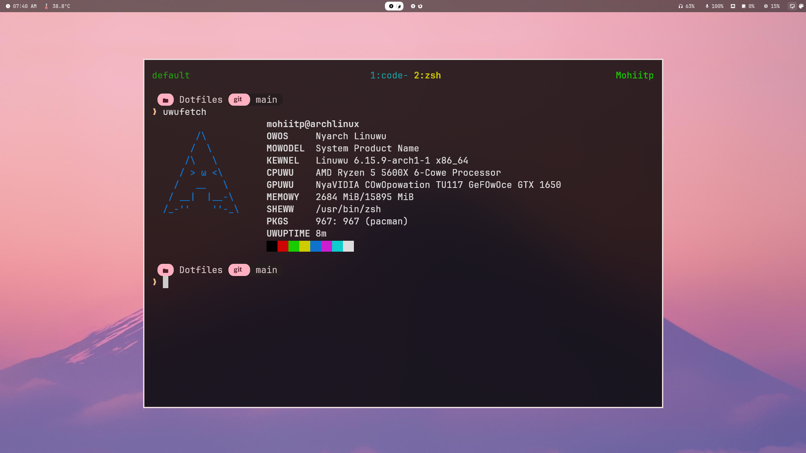

# Window Manager Currently using (Hyprland)
<h4> Hyprland with Wayland </h4>

<br />

<hr />

# Basic tools
```
sudo pacman -S fzf zsh wget neovim curl kitty firefox discord xclip clipboard grim slurp yazi eza zoxide ripgrep base-devel nvidia nvidia-setting nvidia-utils starship unzip btop net-tools git kitty
```

* yay
```
git clone https://aur.archlinux.org/yay
makepkg -si
```

# zsh

* ohmyzsh 
```
sh -c "$(curl -fsSL https://raw.githubusercontent.com/ohmyzsh/ohmyzsh/master/tools/install.sh)"
```

* zsh-syntax-highlighting
``` 
git clone https://github.com/zsh-users/zsh-syntax-highlighting.git \ ${ZSH_CUSTOM:-~/.oh-my-zsh/custom}/plugins/zsh-syntax-highlighting
```

* zsh-autosuggestions
``` 
git clone https://github.com/zsh-users/zsh-autosuggestions ${ZSH_CUSTOM:-~/.oh-my-zsh/custom}/plugins/zsh-autosuggestions
```


* zsh config
```
plugins=(git zsh-autosuggestions zsh-syntax-highlighting web-search)

source $ZSH/oh-my-zsh.sh

export LANG=en_US.UTF-8
export LC_ALL=en_US.UTF-8
export LC_CTYPE=en_US.UTF-8


alias python=/usr/bin/python3
alias vi="nvim"
alias v="vim"
alias cd="z"
alias ga="git pull origin main && git add ."
alias gc="git commit -m"
alias gp="git push origin main"
alias gpl="git pull origin main"
alias gs="git status"
alias mg="cd ~/moLib/moGit"
alias nrd="npm run dev"
alias nrs="npm run start"
alias nrb="npm run build"
alias ta="tmux a"
alias ls="eza"
alias ll="eza --long"
alias la="eza --long --all"
alias lt="eza --tree"

eval "$(starship init zsh)"
eval "$(zoxide init zsh)"

export NVM_DIR="$HOME/.nvm"
[ -s "$NVM_DIR/nvm.sh" ] && \. "$NVM_DIR/nvm.sh"  # This loads nvm
[ -s "$NVM_DIR/bash_completion" ] && \. "$NVM_DIR/bash_completion"
```
# Kanata
* Kanata Config
```
(defcfg
    concurrent-tap-hold yes
    log-layer-changes no
    process-unmapped-keys yes
)

(defsrc
    a s d f
    h j k l ;     
    caps    
    v c n m 
    lalt lctl
)

(defvar
    tap-timeout 150
    hold-timeout 250 
)

(defalias
    escctrl (tap-hold $tap-timeout $hold-timeout esc (multi lmet lctl lalt lsft))
    vimnav (tap-hold $tap-timeout $hold-timeout v (layer-toggle vimnav))
    lalt-mod lctl 
    lctl-mod lalt
    cnav (tap-hold $tap-timeout $hold-timeout c (layer-toggle cnav))
    

  ms↑ (movemouse-accel-up 1 1000 1 5)
  ms← (movemouse-accel-left 1 1000 1 5)
  ms↓ (movemouse-accel-down 1 1000 1 5)
  ms→ (movemouse-accel-right 1 1000 1 5)

)
(deflayer base
    a s d f
    h j k l ;
    @escctrl
    @vimnav @cnav n m 
    @lalt-mod @lctl-mod
)

(deflayer vimnav     
    _   _   _   _   
    left    down    up  right   _   
    @escctrl    
    _  _ _ _
    _  _ 
)
(deflayer cnav
    _   _   _   _   
    @ms← @ms↓ @ms↑ @ms→  _   
    @escctrl    
    _  _  mltp mrtp
    _  _ 
)


```

# GitHub

* Git Config
```
git config --global user.email "your@email.com"
```
```
git config --global user.name "MOHIT-IITP"
```

* Generate SSH Key
```
ssh-keygen -t ed25519 -C "your_email@example.com"
```

# Neovim
* Install Neovim Config
```
git clone git@github.com:MOHIT-IITP/nvim.git
```

# Kitty
* kitty config
```
background_opacity 0.8
window_padding_width 10 

font_family      JetBrainsMono Nerd Font 
bold_font        auto
italic_font      auto
bold_italic_font auto

copy_on_select yes
font_size 16.0
```


